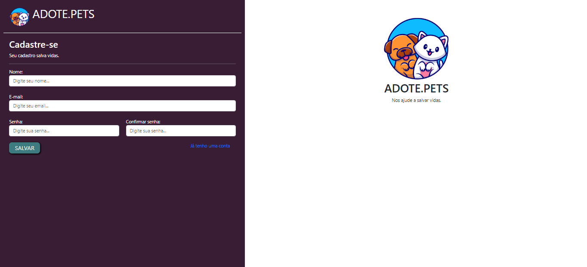
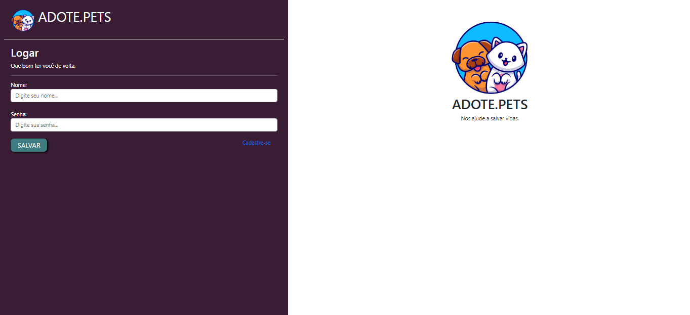
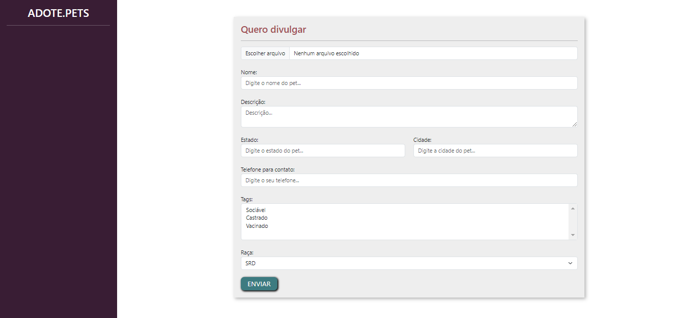
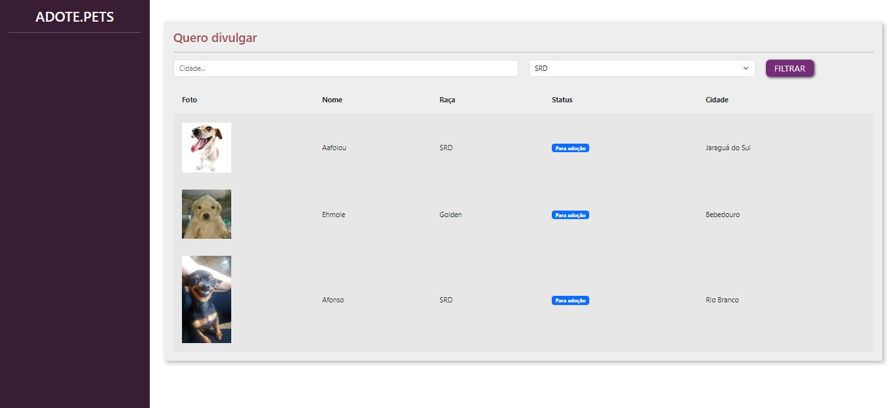
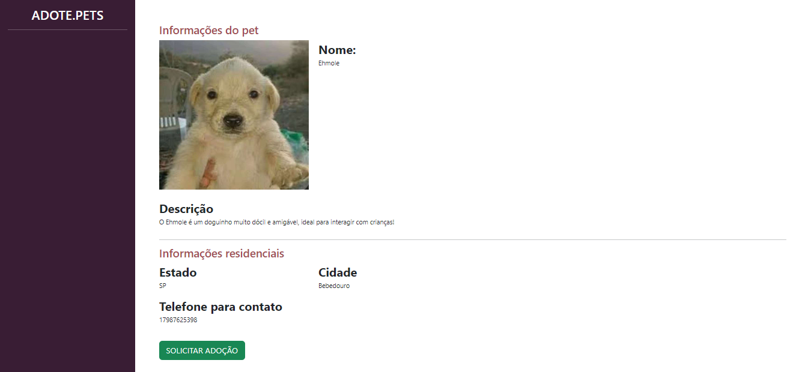
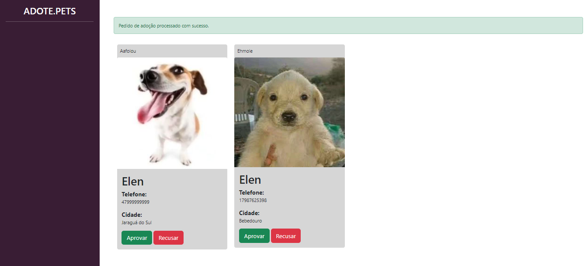
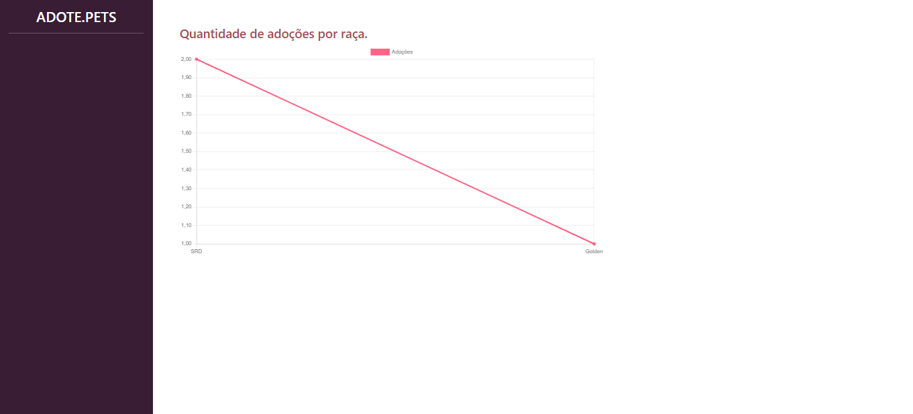

<h1>ADOTE.PETS</h1>

Site para adoção de pets, feito utilizando utilizando Django. Nele possui páginas de cadastro, login, e páginas para visualização dos pets cadastrados pelos usuários. Essa aplicação conta com banco de dados SQLite para armazenar informações sobre os usuários e pets cadastrados, e um sistema de envio de e-mails para solicitação de adoção. Além disso, possui uma dashboard utilizando ChartJS, que, através de uma API do Python, fornece dados de quantos pets foram adotados.

## 🎯 Tecnologias Utilizadas
- Python
- Django
- HTML
- CSS
- Bootstrap
- JavaScript
- SQLite

## 💻 Layouts
- Tela de cadastro de usuários:

- Tela de Login

- Tela para cadastrar novo pet:

- Tela para buscar por um pet por cidade/raça:

- Tela com informações sobre o pet selecionado pelo usuário:

- Tela após a solicitação da adoção:

- Tela com a Dashboard que fornece a quantidade de pets adotados por raça:

---

Feito com ♥ by Monique.

